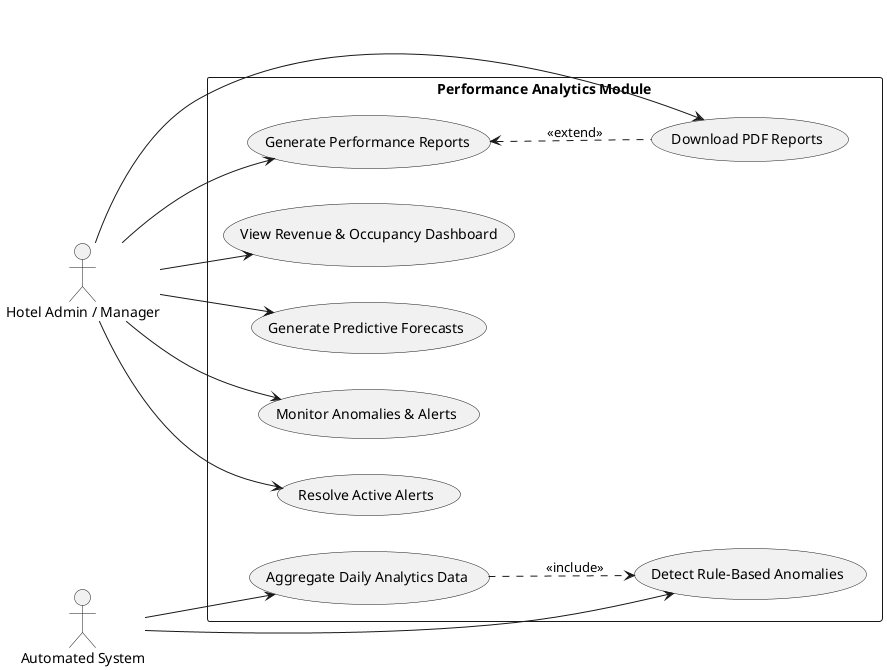
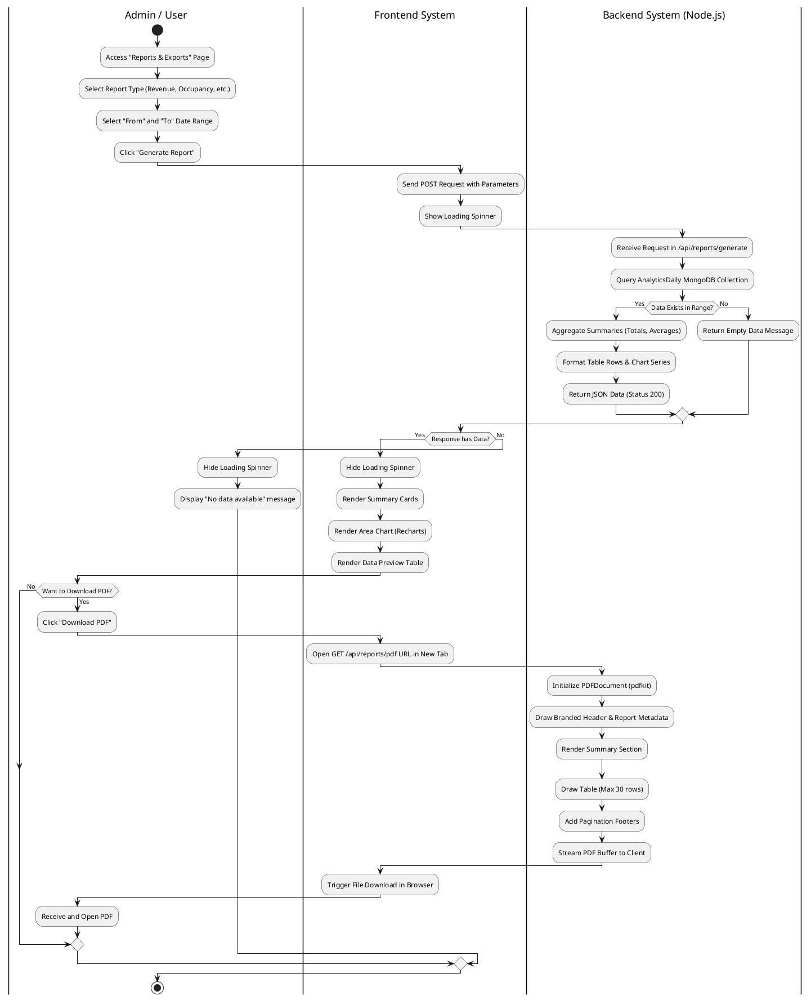

# Performance Analytics Module - UML Diagrams

Here is the PlantUML code for your Use Case Diagram and Activity Diagram. You can copy and paste this code into any PlantUML viewer (like [PlantText](https://www.planttext.com/) or the PlantUML web server) to render the diagrams.

## 1. Use Case Diagram

This diagram shows the main actors (Hotel Admin / Manager and the System) and the primary actions they perform within the Performance Analytics module.

## 2. Activity Diagram

This activity diagram describes the workflow of generating a dynamic performance report and downloading it as a PDF.

